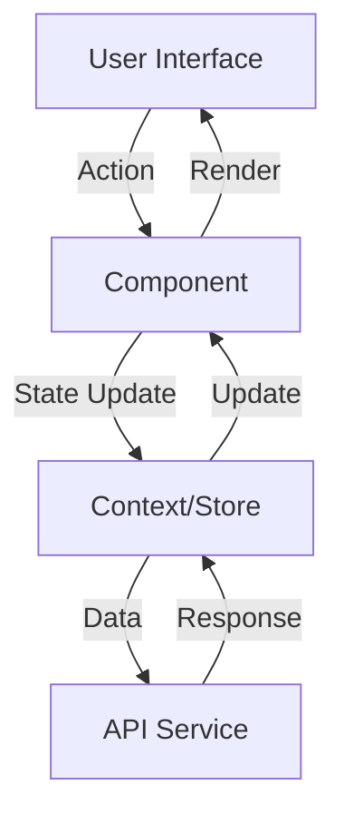

# Frontend Architecture Documentation

## Overview
This document outlines the frontend architecture of the Rapid App, a React-based application built with TypeScript and utilizing the Metronic theme framework.

## Tech Stack
- **Framework**: React with TypeScript
- **Build Tool**: Vite
- **Package Manager**: Yarn
- **UI Framework**: Metronic Theme
- **State Management**: React Context API
- **Routing**: React Router
- **Code Quality**: ESLint

## Project Structure

The application follows a well-organized directory structure that promotes modularity and separation of concerns:

```
rapid-app/
├── src/
│   ├── _metronic/               # Metronic theme integration
│   │   ├── assets/             # Theme assets (images, styles)
│   │   ├── helpers/            # Theme utility functions
│   │   ├── layout/             # Layout components
│   │   └── partials/           # Reusable UI components
│   │
│   ├── app/                    # Main application code
│   │   ├── modules/           # Feature modules
│   │   │   ├── auth/         # Authentication & authorization
│   │   │   ├── channels/     # Channel management
│   │   │   ├── dashboard/    # Dashboard features
│   │   │   ├── domain/       # Domain-specific logic
│   │   │   ├── errors/       # Error handling
│   │   │   ├── groups/       # Group management
│   │   │   ├── histories/    # History tracking
│   │   │   ├── home/         # Home page features
│   │   │   ├── invitations/  # Invitation system
│   │   │   ├── profile/      # User profile
│   │   │   ├── reports/      # Reporting features
│   │   │   ├── things/       # Thing management
│   │   │   └── users/        # User management
│   │   │
│   │   ├── pages/           # Page components
│   │   ├── routing/         # Route configurations
│   │   ├── hooks/           # Custom React hooks
│   │   ├── constants/       # Application constants
│   │   └── App.tsx         # Root component
│   │
│   └── main.tsx              # Application entry point
│
├── public/                    # Static assets
│   ├── media/               # Media files
│   └── favicon.ico         # Site favicon
│
├── index.html                # HTML entry point
├── package.json              # Dependencies and scripts
├── tsconfig.json             # TypeScript configuration
├── vite.config.ts            # Vite configuration
└── .eslintrc.cjs             # ESLint configuration
```

### Key Directories Explained

#### 1. Feature Modules (`src/app/modules/`)
Each feature module is self-contained and follows a consistent structure:
```
module-name/
├── components/     # Module-specific components
├── api/             # API services
└── page.tsx         # Page component
```

#### 2. Core Application (`src/app/`)
- `pages/`: Top-level page components
- `routing/`: Route definitions and guards
- `hooks/`: Shared custom hooks
- `constants/`: Application-wide constants

#### 3. Theme Integration (`src/_metronic/`)
- Metronic theme components and utilities
- Layout management
- Theme-specific assets and styles

#### 4. Configuration Files
- `vite.config.ts`: Build and development configuration
- `tsconfig.json`: TypeScript compiler options
- `.eslintrc.cjs`: Code style and quality rules

### Module Organization

The application is organized into distinct feature modules, each responsible for a specific domain:

1. **Authentication (`auth/`)**
   - Login/Logout functionality
   - Authorization management
   - User session handling

2. **Home (`home/`)**
   - Home page layout
   - Analytics displays

3. **Dashboard (`dashboard/`)**
   - Dashboard creation
   - Widget configuration
   - Data visualization
   - Summary views

4. **User Management (`users/`)**
   - User CRUD operations
   - User permissions
   - Profile management

5. **Invitation System (`invitations/`)**
   - Invitation creation and management
   - User acceptance

6. **Domain Management (`domain/`)**
   - Domain creation and management
   - Organization structure

7. **Profile (`profile/`)**
   - User profile management
   - Change password

8. **Channel Management (`channels/`)**
   - Channel creation and configuration
   - Thing assignment
   - Group assignment
   - Member management

9. **Group Management (`groups/`)**
   - Group creation and management
   - Channel assignment
   - Member administration

10. **Thing Management (`things/`)**
   - Thing creation and management
   - Channel assignment

11. **History Tracking (`histories/`)**
   - Activity logging
   - Data export
   - Analytics

12. **Reports (`reports/`)**

This modular structure enables:
- Independent feature development
- Clear separation of concerns
- Easy maintenance and testing
- Scalable architecture
- Code reusability

## Application Architecture

### 1. Component Organization
The application follows a modular architecture with the following key areas:

```
app/
├── modules/             # Feature-specific modules
├── routing/            # Route configurations
├── constants/          # Application constants
└── pages/              # Top-level page components
```

### 2. Data Flow


### 3. Routing Structure
- Protected Routes
- Public Routes
- Module based Routing
- Lazy Loading for Route Components

### 4. State Management
- Context API for global state
- Local component state for UI-specific data

## Useful Resources

### Official Documentation
- [React Documentation](https://react.dev/)
- [TypeScript Handbook](https://www.typescriptlang.org/docs/)
- [Vite Guide](https://vitejs.dev/guide/)
- [Metronic Theme](https://preview.keenthemes.com/metronic8/demo1/documentation/)
- [React Router Documentation](https://reactrouter.com/en/main)
- [React Table Documentation](https://react-table.tanstack.com/)
- [React Bootstrap](https://react-bootstrap.github.io/)
- [React Bootstrap Typeahead](https://react-bootstrap-typeahead.js.org/)
- [Tanstack/React Query](https://tanstack.com/query/v4/)
- [Axios Documentation](https://axios-http.com/docs/intro)
- [ApexCharts Documentation](https://apexcharts.com/docs/react-charts/)
- [Bootstrap Documentation](https://getbootstrap.com/docs/5.3/getting-started/introduction/)
- [Bootstrap Icons](https://icons.getbootstrap.com/)
- [Yup Documentation](https://github.com/jquense/yup)
- [Formik Documentation](https://formik.org/)
- [Moment Documentation](https://momentjs.com/)
- [Yarn Documentation](https://classic.yarnpkg.com/lang/en/docs/cli/)

